# Code Go 用户使用说明

本文档按真实使用顺序整理，从注册、创建 Key、下载 Codex 配置脚本，到套餐、盲盒、钱包、宠物图鉴与升级规则，统一说明当前前端的页面用途、操作步骤和玩法规则。

## 目录

- [1. 售后 QQ 群](#1-售后-qq-群)
- [2. 主页与入口](#2-主页与入口)
- [3. 注册账号](#3-注册账号)
- [4. 登录控制台](#4-登录控制台)
- [5. 控制台概览](#5-控制台概览)
- [6. 宠物图鉴、装备、升级与增益](#6-宠物图鉴装备升级与增益)
- [7. 创建 API Key](#7-创建-api-key)
- [8. 下载 Codex 配置脚本](#8-下载-codex-配置脚本)
- [9. 套餐选择](#9-套餐选择)
- [10. 盲盒活动](#10-盲盒活动)
- [11. 钱包与扣费顺序](#11-钱包与扣费顺序)
- [12. 界面速查](#12-界面速查)

## 1. 售后 QQ 群

如果在注册、Key 创建、Codex 配置脚本、套餐、盲盒、宠物图鉴或升级过程中遇到问题，可以直接加入售后群。

加入方式：

1. 使用手机 QQ 扫描下方二维码。
2. 如果当前设备不方便扫码，也可以直接在 QQ 中搜索群号 `996040309`。
3. 进群反馈问题时，建议附上账号、页面名称和问题截图。


售后群号：`996040309`

## 2. 主页与入口

主页已经调整为宠物风格首页，首屏会集中展示网站特点、套餐方向、宠物形象和主要入口。

操作步骤：

1. 先浏览首页首屏，了解 Code Go 的定位和核心功能。
2. 从首页进入注册、套餐、说明文档或控制台相关入口。
3. 通过首页的宠物展示，快速理解图鉴养成是站点的重要玩法之一。

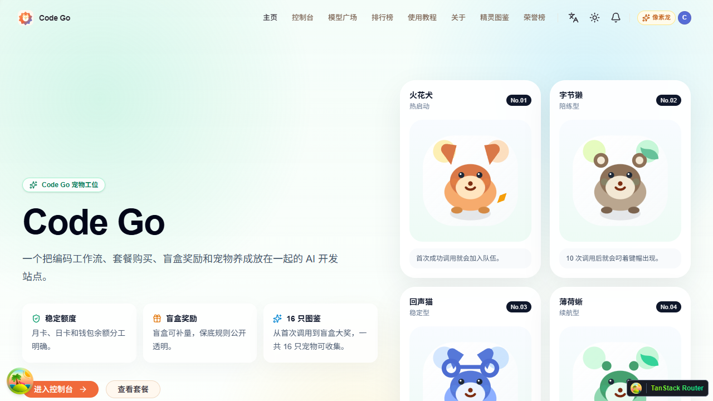

## 3. 注册账号

新用户先完成注册，再进入控制台开始配置使用。

操作步骤：

1. 打开注册页。
2. 填写用户名、邮箱和密码。
3. 提交后完成账号创建。

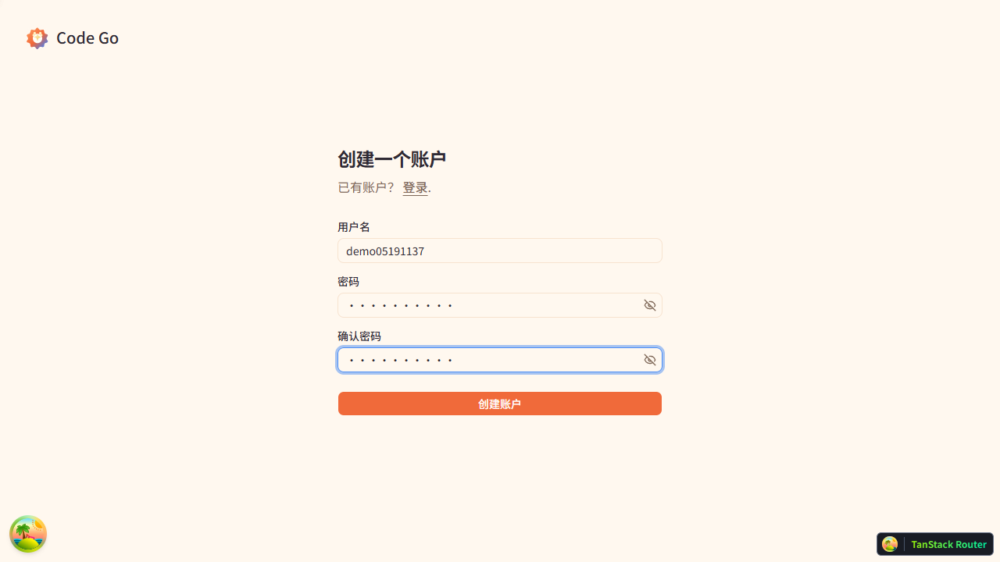

## 4. 登录控制台

注册完成后，使用账号密码登录控制台。

操作步骤：

1. 输入用户名或邮箱。
2. 输入密码。
3. 登录成功后进入控制台概览页。

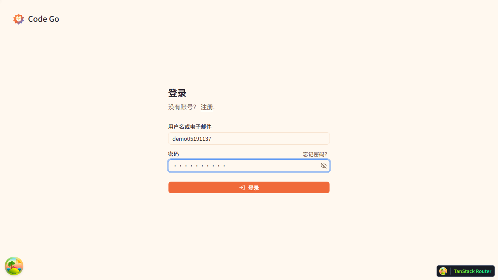

## 5. 控制台概览

概览页是日常使用的起点，会集中展示余额、套餐状态、宠物入口、成就进度和常用导航。

操作步骤：

1. 登录后先查看概览页，确认当前余额和常用功能入口。
2. 从左侧侧边栏进入套餐购买、盲盒活动、钱包、成就图鉴等页面。
3. 重点留意宠物与成就入口，后续升级和增益都从这里进入。

界面变化说明：

- `套餐购买` 已从钱包拆分，改为左侧独立入口。
- `盲盒活动` 已从钱包拆分，改为左侧独立入口。
- `钱包` 继续保留右侧策略栏，用于查看余额和设置扣费顺序。

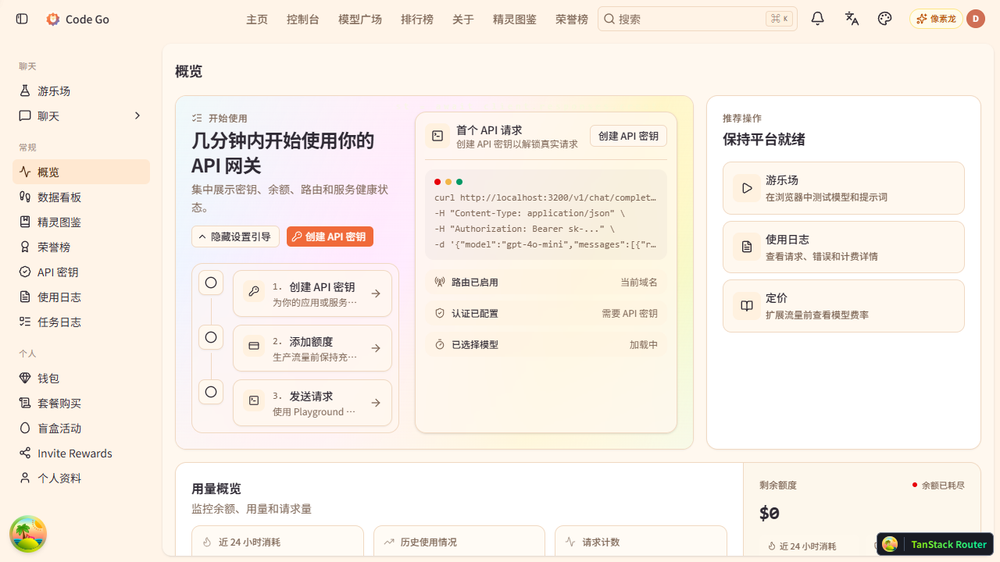

## 6. 宠物图鉴、装备、升级与增益

成就页中的每一只宠物都已经接入实际玩法，不再只是图标装饰。宠物解锁后可以装备、升级，并把增益带到每日任务、签到、盲盒或升级链路。

### 6.1 玩法示意图

```text
成就解锁
   ->
获得对应宠物
   ->
选择一只出战
   ->
完成每日任务拿宠物经验
   ->
投喂额度养宠物
   ->
当前出战宠物的增益立即生效
```

### 6.2 基本规则

- 同一时间只能装备一只宠物，不能同时配备多个宠物。
- 宠物满级为 5 级。
- 完成每日任务会给当前出战宠物发经验。
- 满足经验门槛后，可以手动消耗额度为宠物升级。
- 升级成本前期较低，后期逐步提高，不会很快满级。

### 6.3 升级规则

| 升级阶段 | 所需累计经验 | 升级消耗 |
| --- | ---: | ---: |
| 1 -> 2 | 40 | 0.5 美元额度 |
| 2 -> 3 | 130 | 1.2 美元额度 |
| 3 -> 4 | 310 | 3.0 美元额度 |
| 4 -> 5 | 630 | 6.5 美元额度 |

### 6.4 当前已接入的宠物增益类型

| 增益类型 | 作用位置 | 说明 |
| --- | --- | --- |
| 每日任务额外奖励 | 每日任务 | 完成任务时额外增加额度奖励 |
| 签到补给 | 每日签到 | 签到时附加一份固定额度 |
| 盲盒保底推进 | 盲盒活动 | 减少触发盲盒保底前需要经历的连续低奖励次数 |
| 升级折扣 | 宠物升级 | 减少本次手动升级消耗的额度 |

### 6.5 日常查看重点

1. 看卡片顶部状态，先确认宠物是否已解锁。
2. 看卡片说明，直接确认该宠物的解锁方式。
3. 看当前等级、经验和下一次升级消耗。
4. 点 `出战` 或 `装备`，切换当前生效宠物。
5. 达到升级条件后，点击升级按钮消耗额度进化。

### 6.6 页面上的信息含义

- `已解锁 / 未解锁`：当前是否拥有这只宠物。
- `出战中`：这只宠物当前正在生效。
- `增益效果`：当前等级下的真实功能加成。
- `升级消耗`：本次手动升级需要消耗的额度。
- `解锁方式`：这只宠物对应的成就条件，例如首次调用、连续签到、套餐记录、盲盒记录、邀请记录等。

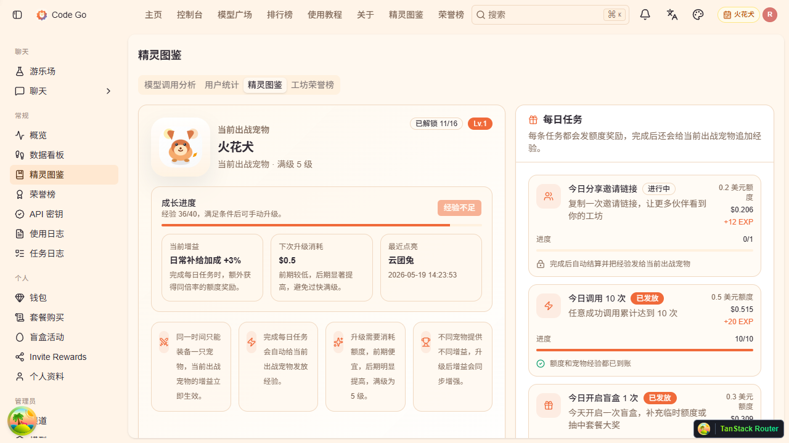

## 7. 创建 API Key

API Key 用于客户端接入、脚本配置和本地开发调用。

操作步骤：

1. 进入左侧 `API 密钥` 页面。
2. 点击创建按钮。
3. 填写名称并选择分组。
4. 保存后返回列表确认 Key 已生成。

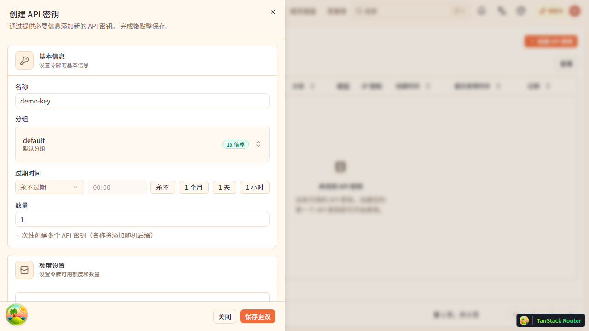

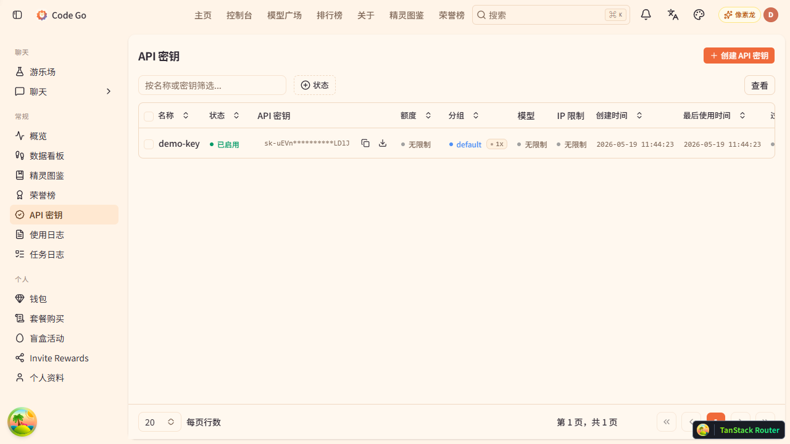

## 8. 下载 Codex 配置脚本

在 Key 列表中可以直接下载 Codex 配置脚本，用于快速完成本地 Codex 初始化。

操作步骤：

1. 在目标 Key 的操作菜单中打开脚本下载项。
2. 选择对应系统版本的脚本。
3. 下载后直接运行。

脚本规则：

- Windows 脚本是 Codex 配置脚本，双击运行后会自动配置好 Codex。
- Windows 脚本执行完成后会保留窗口，显示配置成功提示，并等待按任意键退出。
- Linux 脚本执行完成后会直接输出配置成功提示。
- 脚本内容会基于当前 Key 自动生成，不需要再手动拼接认证信息。

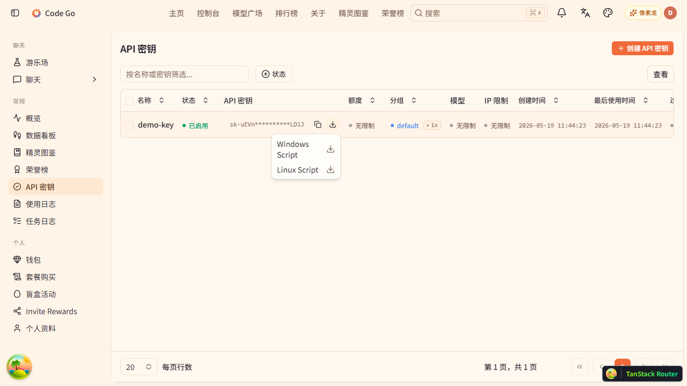

## 9. 套餐选择

套餐购买已经从钱包中拆分出来，单独放在左侧侧边栏。页面会按月卡、日卡和状态面板拆开展示，便于直接比较。

操作步骤：

1. 从左侧进入 `套餐购买` 页面。
2. 对比不同套餐的额度、周期和适用场景。
3. 点击目标套餐的订阅按钮。
4. 在确认弹窗中核对套餐信息后继续。

示意图：

```text
进入套餐页
   ->
比较月卡 / 日卡
   ->
点击立即订阅
   ->
确认套餐信息
   ->
完成购买流程
```

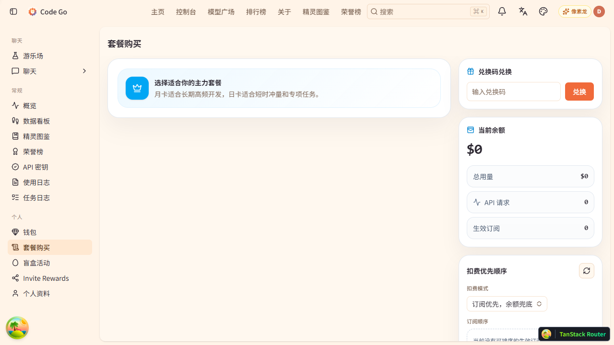

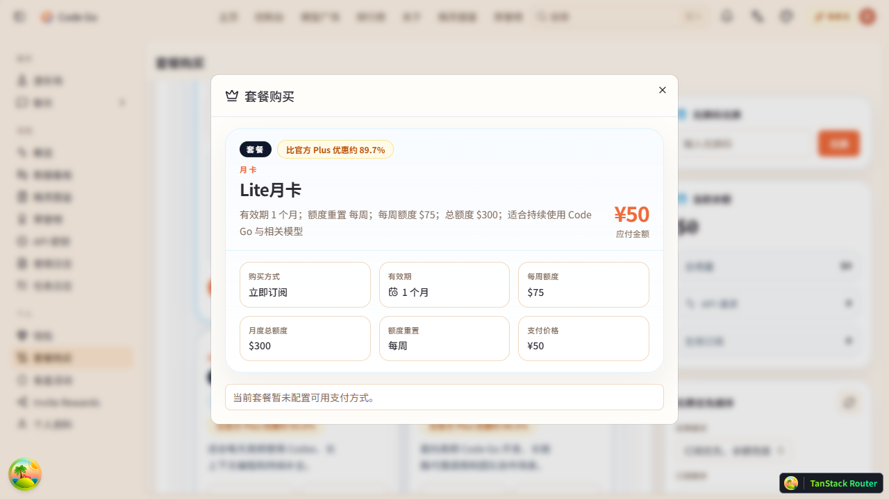

## 10. 盲盒活动

盲盒活动已独立放到左侧侧边栏。页面会显示规则、数量调节、保底逻辑、当前宠物增益和最近开奖记录。

### 10.1 规则示意图

```text
单个盲盒价格 2.5 元
   ->
数量可以自由调整
   ->
如果连续 5 次都低于 5 美元
   ->
触发保底
   ->
下一次必得 10 美元额度
```

### 10.2 操作步骤

1. 从左侧进入 `盲盒活动` 页面。
2. 先查看当前规则与保底说明。
3. 自由调整盲盒数量，不再限制固定档位。
4. 确认金额后进行购买。
5. 查看开奖记录和当前保底进度。

### 10.3 宠物对盲盒的影响

如果当前出战的是盲盒系宠物，它会影响保底推进速度。

示意图：

```text
当前出战宠物
   ->
识别是否为盲盒系增益
   ->
减少触发保底前需要的连续低奖励次数
   ->
更快进入保底区间
```

### 10.4 页面重点

- `单个盲盒价格`：固定为 2.5 元。
- `数量调节`：自由输入或调整数量。
- `保底规则`：连续 5 次低于 5 美元后，下次必得 10 美元额度。
- `宠物增益`：展示当前出战宠物对盲盒保底的影响。
- `最近开奖记录`：查看近期抽取结果。

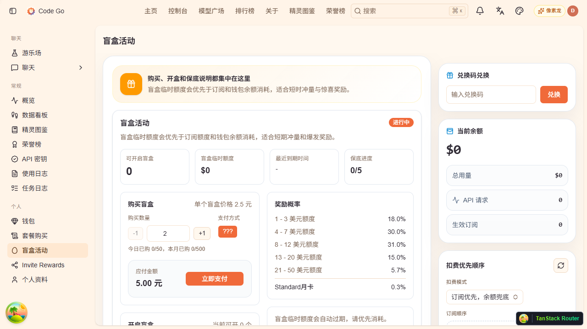

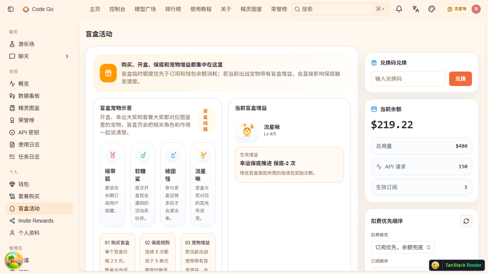

## 11. 钱包与扣费顺序

钱包页现在只负责资金结构、兑换码、账单和扣费顺序设置，不再承载套餐购买和盲盒购买入口。

操作步骤：

1. 进入钱包页查看当前余额、账单和额度结构。
2. 在右侧栏设置扣费策略。
3. 通过兑换码入口补充额度。

扣费顺序查看重点：

- 当前余额和额度概况
- 兑换码入口
- 右侧扣费优先顺序配置
- 订阅优先或余额兜底等策略说明

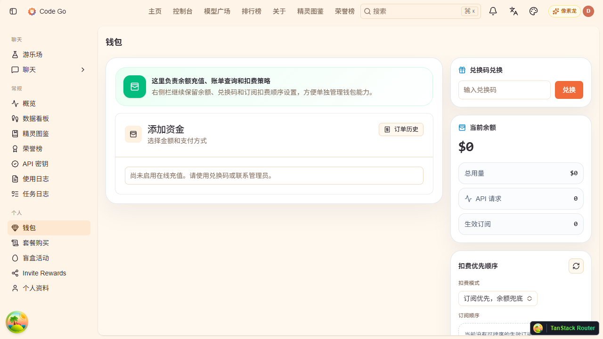

## 12. 界面速查

| 页面 | 主要用途 | 重点关注 |
| --- | --- | --- |
| 首页 | 展示站点特点、宠物风格与主入口 | 注册、文档、套餐方向 |
| 控制台概览 | 日常使用总入口 | 余额、宠物、侧边栏导航 |
| 成就图鉴 | 解锁、装备、升级宠物 | 解锁方式、增益、经验、升级消耗 |
| API 密钥 | 创建调用密钥 | Key 列表、脚本下载 |
| 套餐购买 | 选套餐和进入确认流程 | 周期、额度、适用场景 |
| 盲盒活动 | 购买盲盒与看保底规则 | 数量、保底、宠物加成 |
| 钱包 | 管理余额和扣费顺序 | 兑换码、账单、策略配置 |
| 售后 QQ 群 | 处理使用问题和售后沟通 | 二维码、群号 996040309 |
